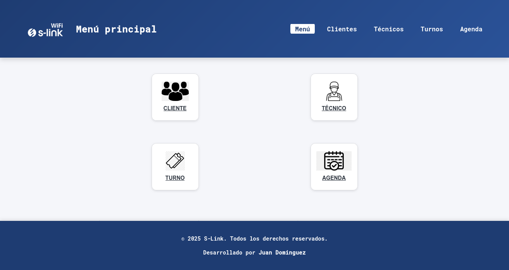
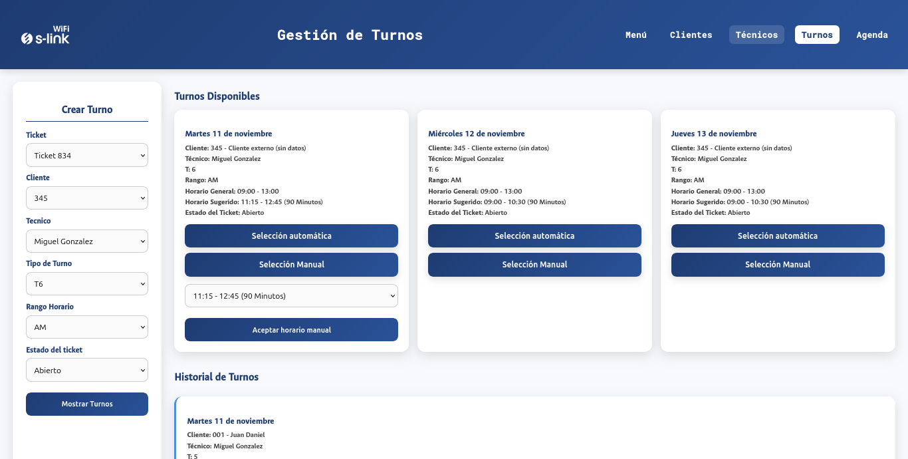
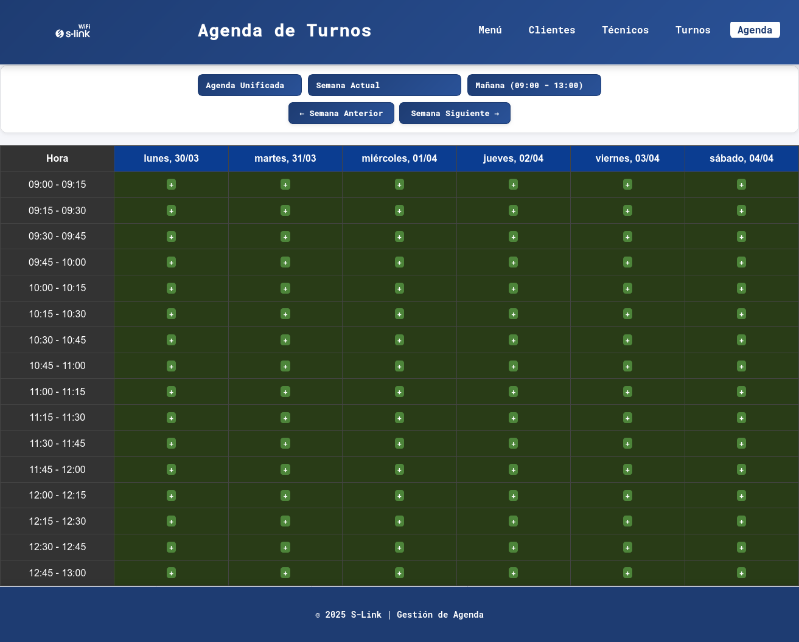

# 🌐 WiFi S-Link | Frontend

> Aplicación web desarrollada para la gestión operativa de instalaciones y soporte técnico de servicios TP-Link, permitiendo administrar clientes, técnicos, agendas y turnos desde una interfaz moderna, organizada y responsive.

---

## 📖 Descripción

WiFi S-Link es el frontend de un sistema de gestión diseñado para centralizar las tareas operativas de un proveedor de servicios de conectividad.

La aplicación permite administrar clientes, técnicos, agendas de trabajo y turnos mediante una interfaz intuitiva, consumiendo una API REST para la persistencia y sincronización de los datos.

El proyecto fue desarrollado priorizando una arquitectura modular, separación de responsabilidades y escalabilidad, facilitando el mantenimiento y la incorporación de nuevas funcionalidades.

---

## ✨ Funcionalidades

- 🔐 Autenticación de usuarios.
- 👥 Administración de clientes.
- 👨‍🔧 Gestión de técnicos.
- 📅 Agenda de trabajo.
- 🎫 Administración de turnos.
- 🔄 Consumo de API REST.
- 📱 Diseño responsive.
- 🔔 Notificaciones al usuario.
- 🧩 Arquitectura modular basada en módulos independientes.
- ⚡ Navegación rápida y optimizada.

---

## 🏗️ Arquitectura

El proyecto fue organizado siguiendo una arquitectura modular basada en funcionalidades.

Cada módulo contiene sus propias capas de:

- Controller
- Service
- Model
- Mapper
- View

Además posee un núcleo común (**Core**) encargado de:

- Autenticación
- Manejo de sesiones
- Protección mediante tokens
- Configuración de API
- Servicios reutilizables
- Componentes base para tablas y CRUD

Esta organización permite mantener el código desacoplado, reutilizable y fácilmente escalable.

---

## 🛠️ Tecnologías utilizadas

- HTML5
- CSS3
- JavaScript (ES6 Modules)
- Vite
- API REST
- Netlify (Deploy)

---

## 📂 Organización del proyecto

```
js/src
├── app
├── core
│   ├── api
│   ├── auth
│   ├── storage
│   └── view
├── modules
│   ├── auth
│   ├── clientes
│   ├── tecnicos
│   ├── agenda
│   └── turnos
└── ui
```

---

## 🎯 Características técnicas

- Arquitectura modular.
- Separación entre lógica de negocio y presentación.
- Consumo centralizado de la API.
- Gestión de autenticación mediante tokens.
- Componentes reutilizables.
- Organización escalable.
- Código mantenible.
- Responsive Design.

---

## 📸 Capturas


### Inicio



### Gestión de Turnos



### Agenda



---

## 🚀 Estado

✅ Proyecto funcional.

Se encuentra preparado para incorporar nuevos módulos y funcionalidades manteniendo la misma arquitectura.

---

## 👨‍💻 Autor

**Juan Domínguez**

Desarrollador Full Stack

- PHP
- JavaScript
- Python
- MySQL

---

## 📄 Licencia

Este repositorio tiene fines demostrativos para mostrar la arquitectura, organización y desarrollo del frontend del sistema.
